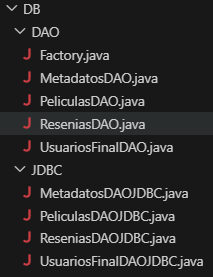
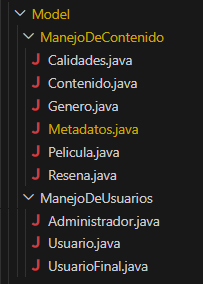
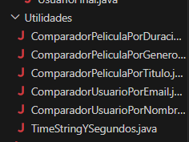

# Taller de Lenguajes II 2025
Integrantes: Alam Meza y Nicolás Peñalba

## Convenciones
 - En el manejo de usuario: en un futuro pensamos implementar los géneros preferidos por el usuario y el historial en tablas individuales en la BD, asi que por el momento no lo manejamos.
  - En metadatos respetando el UML se considera arrays el elenco y subtítulo pero en el código usamos una lista temporal y luego cambiamos a Array.
  - En Pelicula la direccion de archivo es un string lo dejamos así ya que está fuera del alcance del entregable. Tenemos planeado guardar dichas direcciones en su correspondiente tabla de la BD.
 - En Pelicula la duración que (es un timer) consideramos convertirlo a string para que lo gestione la BD y luego lo convierta de vuelta a Timer.
 - Pensamos refactorizar menuResenia.java y dividirlo en el manejo de cada segmento del programa, pero visto la mayoria de código no es nada más que el manejo de la consola lo dejamos. Somos conscientes que es un código demasiado grande y faltaria optimizarlo.
 - Estuvimos teniendo muchos problemas con el manejo del scanner, si bien funciona bien con strings sin espacios el segundo que se sale de esa convencion puede variar el resultado. Visto que en el siguiente tp pasaremos a una UI de verdad, decidimos priorizar el manejo de la bd y de los datos internos.

 ## Estructura de datos:

 - Carpeta DB: interfaces de todas las tablas pertenecientes a la base de datos y su implementación en JDBC y el factory que controla e inicia todo.

      
 - Carpeta Model: contiene todos los objetos utilizados.

    
- Utilidades: contiene los comparadores de elementos y el conversor que usamos para manejar la duracion de las peliculas.

    
